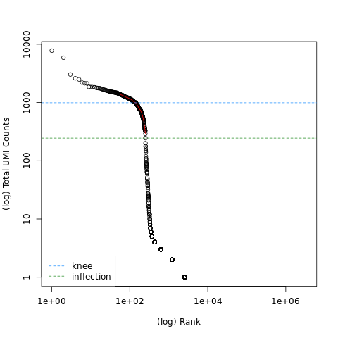
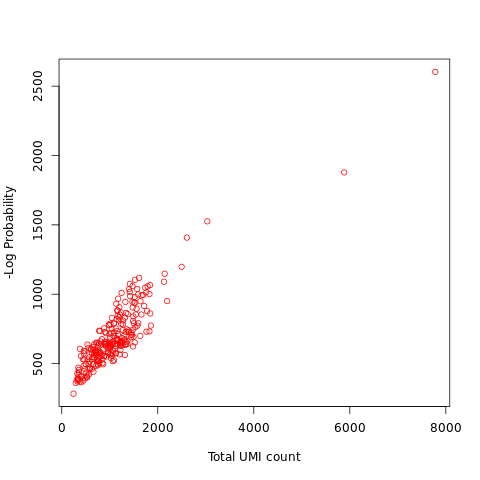

# 01-Preprocessing: 10X Genomics Pipeline

This repository contains the documentation and workflow associated with the **"Pre-processing of 10X Single-Cell RNA Datasets"** tutorial from the Galaxy Training Network (GTN). 

## Overview
Single-cell RNA sequencing (scRNA-seq) provides high-throughput resolution for examining cell heterogeneity. This project focuses on the initial, crucial stage of the bioinformatics pipeline: transforming raw FASTQ sequencing data into a reliable, quality-controlled count matrix.

### Key Objectives
* **Demultiplexing & Quantification:** Converting raw 10X Genomics FASTQ files into a gene-by-cell count matrix.
* **Mapping:** Using **RNA STARsolo** for efficient, high-throughput alignment of reads to the reference genome (hg19/GRCh37).
* **Quality Control (QC):** Identifying and filtering low-quality cells based on barcode rankings, mitochondrial content, and feature counts to ensure the integrity of downstream analysis.

## Pipeline Workflow

The analysis follows these primary steps:

1. **Data Acquisition:** Importing sub-sampled PBMC (Peripheral Blood Mononuclear Cell) datasets and necessary annotations.
2. **Mapping (STARsolo):** Alignment of cDNA reads while utilizing a cell barcode "whitelist" to demultiplex samples.
3. **QC Assessment:** Investigating the STARsolo feature statistics to determine the number of detected cells and mapping quality.
4. **Matrix Refinement:** Filtering the raw matrix based on QC thresholds to produce a high-quality dataset suitable for downstream biological interpretation.

## Data Visualizations

This project emphasizes visual QC using specific plots generated during the pre-processing stage:

| Plot Name | Visualization Description | Key Information Provided |
| :--- | :--- | :--- |
| **Barcode Rank Plot** | A log-log plot ranking barcodes by UMI count (y-axis) vs. rank (x-axis). | Identifies the "knee" and "inflection" points used to distinguish actual cells from background noise. |
| **QC Scatter Plot** | Scatter plot of Total UMI count (x-axis) vs. -Log Probability (y-axis). | Visualizes technical noise and identifies outlying cells. |

### Results: Quality Control

The following plots were generated during the pre-processing stage to ensure data quality:

**Barcode Rank Plot**

*Figure 1: Rank of barcodes by UMI counts used to identify the "knee" and "inflection" points.*

**QC Scatter Plot**

*Figure 2: Scatter plot of Total UMI count vs. -Log Probability to visualize technical noise and outliers.*

## How to Reproduce
1.  Access the tutorial via the [Galaxy Training Network (GTN)](https://training.galaxyproject.org/training-material/topics/single-cell/tutorials/scrna-preprocessing-tenx/tutorial.html).
2.  Use the provided sub-sampled FASTQ files from the tutorial's Zenodo link.
3.  Ensure you are using **RNA STARsolo** (version 2.7.11a+galaxy1 or similar) with the **Chromium v3** chemistry settings as detailed in the pipeline workflow.

## Next Steps
This pre-processing module provides the high-quality count matrix required for downstream analysis. Future modules will cover:
* **Dimensionality Reduction:** Normalization, variable gene selection, and PCA.
* **Clustering & Annotation:** Leiden clustering and cell-type assignment.
* **Differential Expression:** Identifying marker genes between defined cell populations.

## Tools & Resources
* **Platform:** [UseGalaxy.org](https://usegalaxy.org/)
* **Alignment Tool:** [RNA STARsolo](https://github.com/alexdobin/STAR)
* **Supporting Framework:** [Galaxy Training Network (GTN)](https://training.galaxyproject.org/training-material/)
* **Dataset:** 1k PBMCs from a Healthy Donor (10X Genomics, v3 Chemistry)

## References
* **Melsted, P. et al. (2019).** Modular and efficient pre-processing of single-cell RNA-seq. [doi:10.1101/673285](https://doi.org/10.1101/673285)
* **Tekman, M. et al. (2020).** A single-cell RNA-sequencing training and analysis suite using the Galaxy framework. *GigaScience*. [doi:10.1093/gigascience/giaa102](https://doi.org/10.1093/gigascience/giaa102)

---
*This analysis was performed as part of training in translational bioinformatics.*
