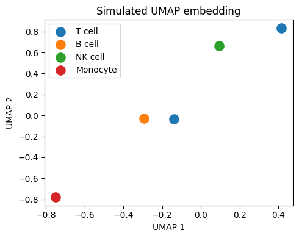

# Task 3 — AnnData Tutorial

Exploration of the **AnnData** data structure, which is the core data format used throughout the scverse bioinformatics ecosystem (Scanpy, scvi-tools, etc.).

**References:**
- [AnnData Getting Started](https://anndata.readthedocs.io/en/latest/tutorials/notebooks/getting-started.html)
- [scverse AnnData Tutorial](https://scverse-tutorials.readthedocs.io/en/latest/notebooks/anndata_getting_started.html)

---

## What is AnnData?

AnnData (Annotated Data) is an efficient, column-store data structure for storing single-cell data. It holds:

```
AnnData object
├── .X          → expression matrix (cells × genes)
├── .obs        → cell-level metadata (DataFrame)
├── .var        → gene-level metadata (DataFrame)
├── .obsm       → cell embeddings (PCA, UMAP, tSNE)
├── .varm        → gene loadings (PCA components)
├── .obsp       → pairwise cell matrices (distances, graphs)
├── .uns        → unstructured metadata (any dict)
└── .layers     → alternative expression matrices (raw, spliced, etc.)
```

---

## What This Notebook Does

| Step | Description |
|---|---|
| 1. Create | Build an AnnData object from scratch |
| 2. Inspect | Explore `.X`, `.obs`, `.var`, `.obsm`, `.uns` |
| 3. Add metadata | Annotate cells and genes with custom data |
| 4. Subset | Slice the AnnData like a DataFrame |
| 5. Concatenate | Merge two AnnData objects |
| 6. Layers | Work with multiple expression matrices |
| 7. Read/Write | Save to `.h5ad` and reload from disk |
| 8. Real data | Apply AnnData operations on PBMC 3K |

---
### UMAP Embedding


---

## How to Run

### Google Colab
Open `03_anndata_tutorial.ipynb` in Colab and run all cells.

### Local
```bash
pip install anndata scanpy matplotlib pandas numpy
jupyter notebook 03_anndata_tutorial.ipynb
```

---

## Output Files

| File | Description |
|---|---|
| `my_anndata.h5ad` | Custom AnnData saved to disk |
| `pbmc3k_anndata_demo.h5ad` | PBMC data with extra annotations |

---

## References

Virshup I, Rybakov S, Theis FJ, Angerer P, Wolf FA. anndata: Annotated data. *bioRxiv* (2021). https://doi.org/10.1101/2021.12.16.473007
